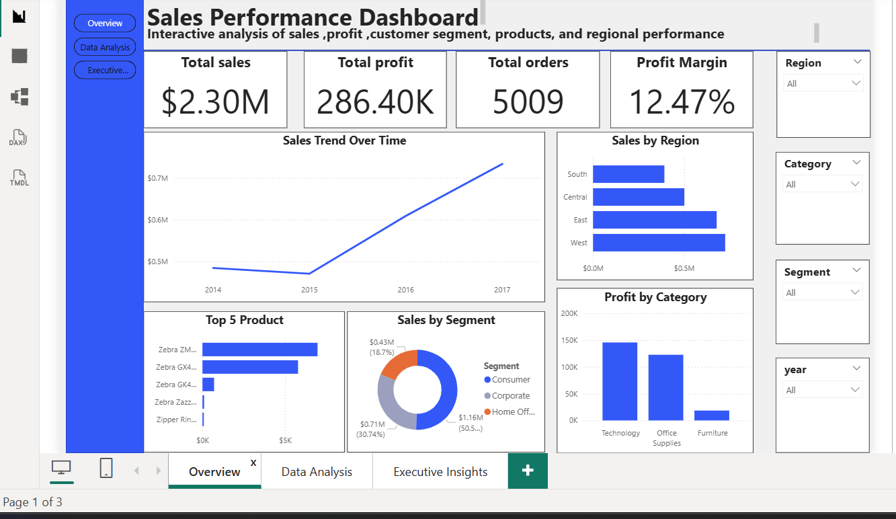
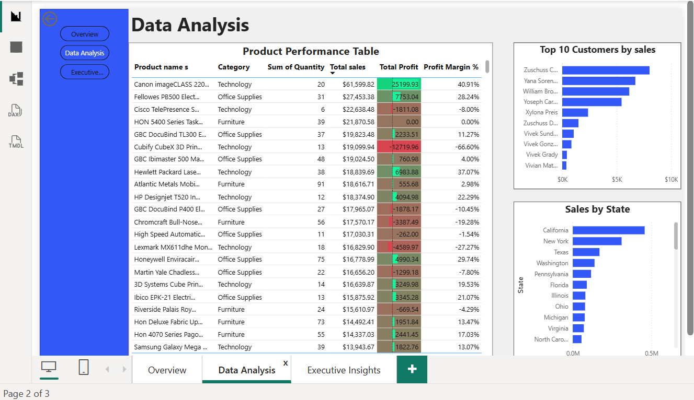
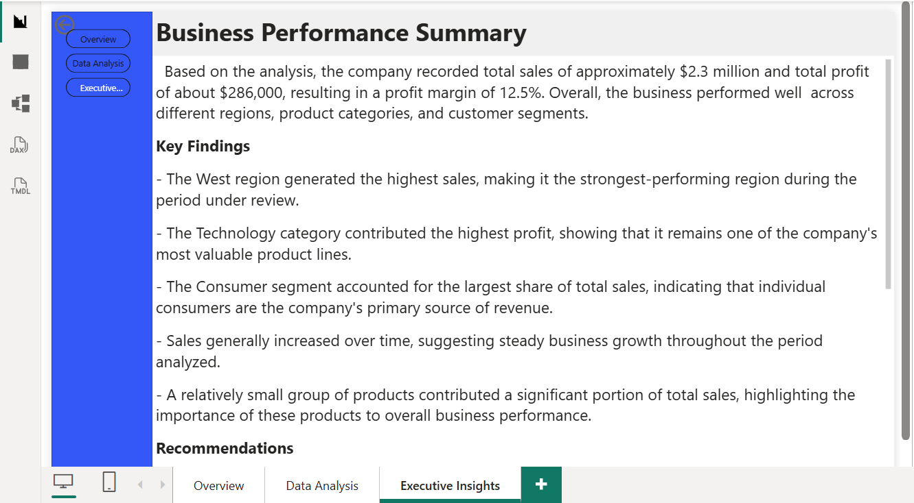

# Sales Performance Dashboard (Power BI)

An interactive dashboard analyzing sales, profit, customer segments, products, and regional performance to help leadership identify what's driving revenue and where to focus next.

## Business Problem

Sales leadership needed a single, interactive view to answer: Which regions, products, and customer segments are driving the most sales and profit? Is the business growing over time? Where is profitability weakest? This dashboard consolidates raw sales transaction data into a tool non-technical stakeholders can explore on their own, filtered by region, category, segment, and year.

## Data Source

Sample Superstore retail sales dataset (transaction-level sales, profit, customer, product, and regional data, 2014–2017). *(Update this if you used a different/original source.)*

## Tools Used

- Power BI Desktop (data modeling, DAX measures, visuals)
- Excel (initial data review/cleaning)
- DAX for calculated measures (Profit Margin, Total Sales, Total Profit)

## Process

1. Imported and reviewed the raw sales dataset for data quality issues
2. Built a data model and created DAX measures for Total Sales, Total Profit, Total Orders, and Profit Margin
3. Designed a 3-page report: **Overview**, **Data Analysis**, and **Executive Insights**
4. Added slicers (Region, Category, Segment, Year) for interactive filtering
5. Wrote up findings into a plain-language executive summary for non-technical stakeholders

## Dashboard Pages

### 1. Overview
KPIs at a glance (Total Sales, Total Profit, Total Orders, Profit Margin), sales trend over time, sales by region, top 5 products, sales by segment, and profit by category.

### 2. Data Analysis
A detailed product performance table (quantity, sales, profit, margin %), plus top 10 customers by sales and sales by state.

### 3. Executive Insights
A written business performance summary translating the visuals into key findings and recommendations for leadership.

## Key Findings

- Total sales reached **$2.3M** with total profit of **$286K**, a profit margin of **12.47%** across 5,009 orders
- The **West region** generated the highest sales, making it the strongest-performing region
- The **Technology category** contributed the most profit, making it the company's most valuable product line
- The **Consumer segment** accounted for the largest share of total sales (50.5%), ahead of Corporate (30.74%) and Home Office (18.7%)
- Sales trended upward from 2014 to 2017, indicating steady business growth
- A small group of top products (led by Zebra printers) drove a disproportionate share of total sales

## Recommendations

- Double down on marketing and inventory investment in the West region given its consistent outperformance
- Protect and grow the Technology category's margins, since it's the strongest profit driver
- Investigate underperforming products/categories (e.g., low-margin Office Supplies items) to improve overall profitability
- Develop targeted retention strategies for top customers, since a small group contributes a large share of revenue

## Files in This Repo

- `sales-performance-dashboard.pbix` – Power BI source file
- `sales-performance-dashboard.pdf` – Full dashboard export (PDF)
- `overview.png`, `data-analysis.png`, `executive-insights.png` – Dashboard page screenshots
- `README.md` – This file

---
*Built by Blessing Ogbuzuo as part of a data analytics portfolio.*
